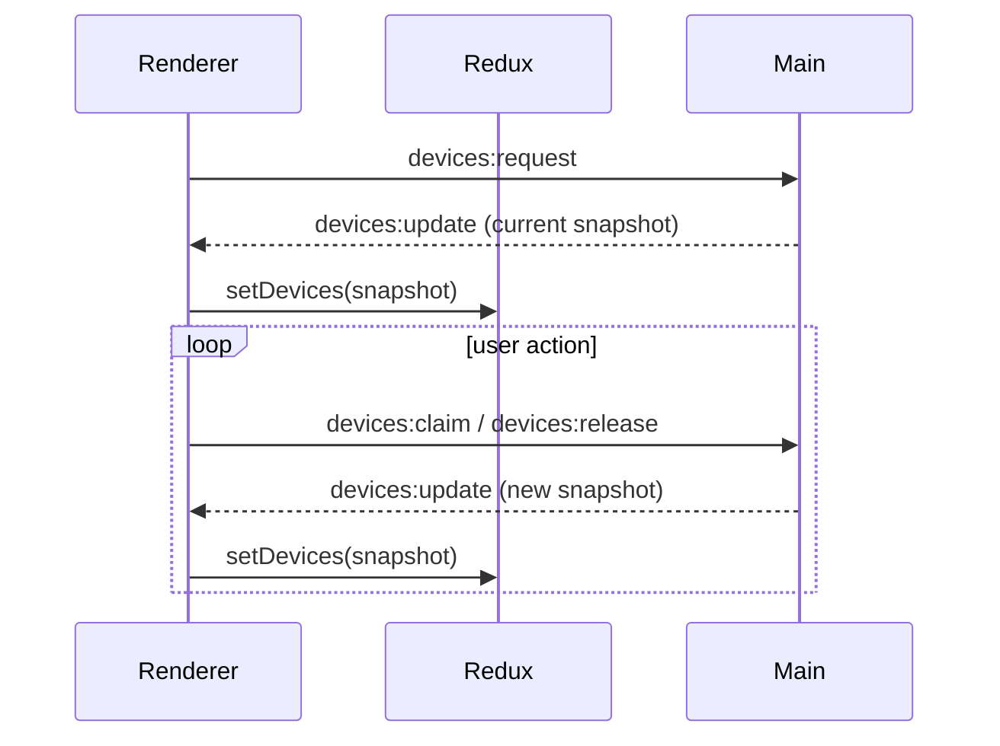

# All-in-One Application

Electron + React + TypeScript starter that ships with hot reload in development and packaging via `electron-builder`.

## Features
- React renderer bundled with Webpack
- Electron main process written in TypeScript
- Nodemon-based dev loop that rebuilds both processes then relaunches Electron
- Redux Toolkit for renderer state management backed by IPC messages

## Getting Started
1. `npm install`
2. `npm run dev` – rebuilds main + renderer then launches Electron with DevTools
3. `npm run typecheck`
4. `npm test`
5. `npm run build` – production bundles
6. `npm run dist` – create installers via `electron-builder`

## Key Scripts
- `npm run dev:build` – only rebuilds main + renderer
- `npm run build:main` – compile `src/main/**`
- `npm run build:renderer` – Webpack build for the renderer
- `npm run test:ui` – Playwright smoke tests (requires `npm run build`)

## Project Structure
- `src/main/app/main.ts` – creates the `BrowserWindow`, installs DevTools, registers IPC handlers
- `src/renderer/app/App.tsx` – React root component
- `src/renderer/app/store/**` – Redux Toolkit store and slices
- `src/shared/models/**` – shared TypeScript types
- `docs/redux-structure.md` – architecture notes for Redux

## Device Workflow
1. Main process holds an in-memory list of mock USB devices (see `main.ts`).
2. Renderer imports `ipcRenderer` directly (contextIsolation is disabled) and:
   - sends `devices:request` to fetch the latest snapshot
   - listens for `devices:update` broadcasts
   - issues `devices:claim` / `devices:release` commands
3. Redux stores the snapshot (`devices.slice.ts`), so every component uses the same data.

## Packaging Notes
- Run `npm run build` before `npm run dist`
- `electron-builder` config lives in `package.json`

