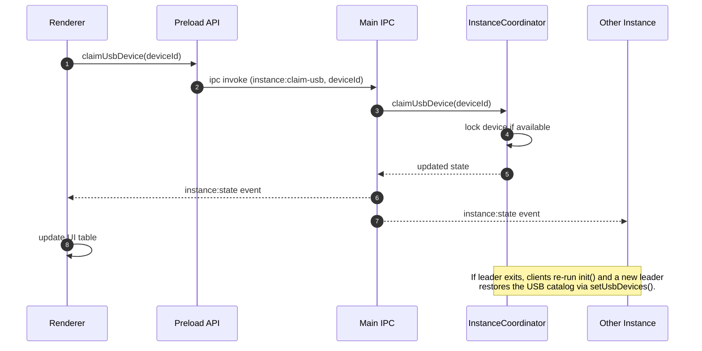

# All-in-One Application

An Electron + React + TypeScript starter that ships with secure preload bridges, hot-reload friendly tooling, and packaging via `electron-builder`.

## Features
- Typed React renderer bundled by Webpack
- Hardened Electron main process with preload context isolation
- Simple `nodemon`-driven dev loop that rebuilds main + renderer then relaunches Electron with DevTools
- Production build + installer generation powered by `electron-builder`

## Getting Started
1. Install dependencies
   ```bash
   npm install
   ```

2. Start development mode (nodemon watches `src/**`, rebuilds, then relaunches Electron with DevTools)
   ```bash
   npm run dev
   ```

3. Type-check without emitting files
   ```bash
   npm run typecheck
   ```

4. Run unit tests (Jest + ts-jest)
   ```bash
   npm test
   ```

5. Produce production assets (`dist/`) and TypeScript output (`dist/main.js`, `dist/preload.js`)
   ```bash
   npm run build
   ```

6. Build distributables / installers
   ```bash
   npm run dist
   ```

## Available Scripts
- `npm run dev:build` – Rebuilds the main process (`tsc`) and renderer bundle (`webpack`) without launching Electron.
- `npm run build:main` – Compiles everything under `src/main/**` (including preload) into `dist/main/**`.
- `npm run build:renderer` – Bundles the React renderer (`src/renderer/app/renderer.tsx`) with Webpack in development mode.
- `npm run typecheck` – Runs the TypeScript compiler in `--noEmit` mode for faster feedback.
- `npm test` – Executes Jest with `ts-jest`, producing coverage in `coverage/`.
- `npm run test:ui` – Builds the app then runs Playwright-based Electron smoke tests.
- `npm run build` – Runs the production renderer build plus `tsc -p tsconfig.prod.json`.
- `npm run dist` – Packages the app via `electron-builder` (requires `npm run build` first).

## Project Structure
- `src/main/index.ts` – Electron entry point wiring `app` events to the bootstrap layer
- `src/main/app/main.ts` – Creates BrowserWindows, installs DevTools, coordinates lifecycle
- `src/main/preload/**` – ContextIsolation bridges (one file per exposed API)
- `src/renderer/app/App.tsx` – React root component
- `src/renderer/app/renderer.tsx` – React entry rendered by Webpack
- `src/shared/models/**` – Types shared between main, preload, and renderer
- `tests/**` – Centralized Jest specs (mirrors shared/renderer layers)
- `webpack.config.js` – Renderer bundler configuration
- `tsconfig*.json` – Shared / production TypeScript configs
- `index.html` – Renderer HTML shell loaded by the main process

## Multi-instance coordination workflow
The app now detects and coordinates multiple `app.exe` processes, keeps a running count, and arbitrates USB ownership across instances. The flow is:

1. **Main-process bootstrap**
   - `InstanceCoordinator` (in `src/main/app/instance-coordinator.ts`) tries to bind a named pipe derived from the product name.
   - If binding succeeds, the current process becomes the **leader** and listens for peers; otherwise it connects as a client.
   - The leader tracks connected sockets, polls the OS with `ps-list` to count additional executables, and stores USB ownership (by PID).

2. **IPC surface**
   - `registerInstanceHandlers` (in `src/main/app/main.ts`) exposes `instance:get-state`, `instance:claim-usb`, and `instance:release-usb` handlers plus broadcasts `instance:state` events to renderers.
   - When the window is created we immediately send a snapshot so the UI has data before real-time events arrive.

3. **Preload bridge**
   - `src/main/preload/index.ts` exports type-safe helpers: `getInstanceState`, `onInstanceState`, `claimUsbDevice`, and `releaseUsbDevice`.
   - The renderer never touches `ipcRenderer` directly, keeping ContextIsolation intact.

4. **Renderer dashboard**
   - `App.tsx` calls the preload helpers, renders PID/leader/count/USB ownership details, and offers buttons that call `claimUsbDevice` / `releaseUsbDevice`.
   - The dashboard renders every device listed in `trackedUsbDevices` (defined in `src/main/preload/api/usb-devices.ts`) so you can coordinate multiple USB endpoints independently.
   - When an instance claims a given device, the leader broadcasts a state update that tells every other window who currently owns it (e.g., “This instance” vs “PID 12345”).

5. **Inter-instance messaging**
   - Peers talk to the leader with newline-delimited JSON messages (`hello`, `usb-claim`, `usb-release`).
   - The leader re-sends `state` payloads to all connected sockets, so every instance stays synchronized and can make informed UX decisions (e.g., warning if two windows are open).

This workflow ensures that if two executables are launched simultaneously:
- Both can see the accurate process count (live connections + OS scan).
- Instance #2 receives a message if Instance #1 already owns the specific USB device and can inform the user rather than conflicting at the OS level.
- If the leader quits unexpectedly, remaining clients retry `init()` after a short delay so another instance seamlessly takes over coordination duties.

### Detailed device/instance flow (with UML)

1. **USB catalog loading**
   - `main/app/main.ts` boots the app, instantiates `InstanceCoordinator`, and immediately calls `setUsbDevices(getTrackedUsbDevices())`.
   - `getTrackedUsbDevices` (under `src/main/preload/api/usb-devices.ts`) is the single source of truth for which physical devices need coordination. Swap its implementation to fetch from disk, an HTTP API, etc., without touching the coordinator.
2. **Leader election & instance discovery**
   - First instance binds the named pipe and becomes leader; others connect as clients, send `hello`, and receive the current state.
   - Leader compiles two counts: active sockets (`estimatedCount`) and OS-level processes (`processCount` via `ps-list`) to capture stragglers.
3. **Claim / release handshake**
   - Renderers trigger `window.electronAPI.claimUsbDevice(deviceId)`; the preload bridge relays this through `ipcRenderer.invoke` to `InstanceCoordinator`.
   - Leader validates ownership. If free, it assigns the requesting PID, updates the device list, and broadcasts the new `instance:state`.
   - Release requests follow the same path, clearing the owner and rebroadcasting.
4. **Real-time UI updates**
   - Every renderer subscribes to `onInstanceState` and redraws counts + USB owners when a push arrives, so all windows stay aligned.



## Packaging Notes
- Run `npm run build` before `npm run dist` so both `dist/main/**` and `dist/bundle.js` exist.
- `electron-builder` configuration (app id, product name, targets) lives in `package.json`.
- Ensure `index.html`, `dist/main/index.js`, `dist/main/preload/index.js`, and `dist/bundle.js` are present in the app bundle.