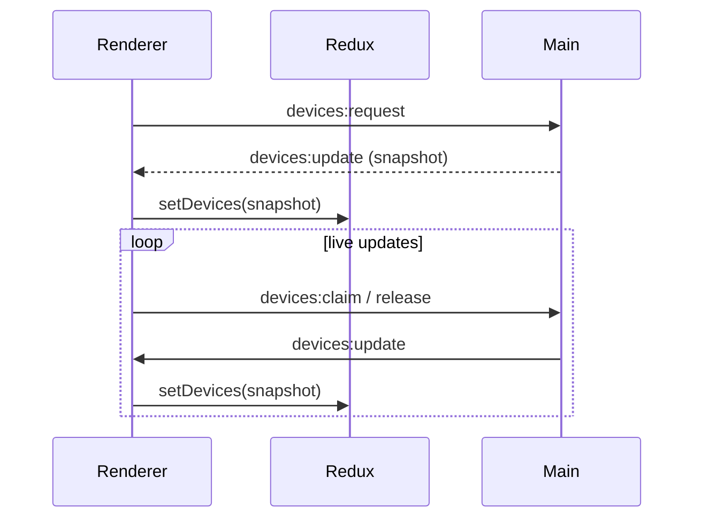

# All-in-One Application

Electron + React + TypeScript starter that ships with hot reload in development and packaging via `electron-builder`. Everything is wired for a secure IPC channel, Redux Toolkit global state, and realistic build/test tooling.

## Stack & Versions
| Layer        | Technology / Version                                              |
|--------------|-------------------------------------------------------------------|
| Renderer UI  | React 18 + Redux Toolkit + plain CSS                              |
| Main process | Electron 39 (TypeScript)                                          |
| Bundler      | Webpack 5 + Babel (`@babel/preset-react`, `@babel/preset-typescript`) |
| Tests        | Jest 30 (`ts-jest`, Testing Library) & Playwright 1.56            |
| Packaging    | `electron-builder` 25                                             |

## Getting Started
1. Install deps: `npm install`
2. Development mode: `npm run dev` – recompiles `src/**` via webpack + nodemon and launches Electron
3. Type checking: `npm run typecheck`
4. Unit tests: `npm test`
5. Production build: `npm run build` – emits `dist/main/**` (tsc) + `dist/bundle.js` (webpack)
6. Package installers: `npm run dist`

## Build Workflow Overview
- **Webpack entry point** – `src/renderer/app/renderer.tsx` is the single entry. Webpack runs with `target: 'electron-renderer'`, so the bundled JS can access Electron APIs.
- **Babel + TypeScript** – `.tsx` files go through `babel-loader`, using presets from `.babelrc` (`@babel/preset-react` + `@babel/preset-typescript`). `tsc` is only used for the main/preload build and type-checking.
- **tsconfig roles**
  - `tsconfig.json` – base config for `npm run build:main` and `npm run typecheck`.
  - `tsconfig.prod.json` – stricter variant used by `npm run build`.
  - `tsconfig.test.json` – lightweight config for `ts-jest`, excludes Electron globals.
- **CSS pipeline** – `css-loader` + `style-loader` let you `import './App.css'`. `style-loader` injects styles directly into the DOM, so `index.html` enables them by disabling `contextIsolation`.
- **Jest** – `tests/..../App.test.tsx` exercises Redux flows using Testing Library; CSS modules are stubbed by `identity-connector`.
- **Playwright** – `tests/playwright.config.ts` launches the bundled app via `_electron`, ensuring the full stack works end-to-end.

## Webpack Outputs
- `npm run build:renderer` (or `npm run build`) emits:
  - `dist/bundle.js` – minified renderer bundle consumed by `index.html`.
  - `dist/bundle.js.map` – source map (suppressed in production builds).
  - `dist/bundle.js.LICENSE.txt` – third-party notices collected by Webpack.

## TypeScript Outputs

| Command / Config          | Description                                                |
|---------------------------|------------------------------------------------------------|
| `npm run build:main` + `tsconfig.json` | Compiles `src/main/**` (Electron main + preload) to `dist/main/**` (`dist/main/app/main.js`, `dist/main/index.js`, etc.). |
| `npm run build` + `tsconfig.prod.json` | Same as above, but with stricter compiler flags for production (no incremental builds, stricter diagnostics). |
| `npm run typecheck` (`tsconfig.json`) | Runs tsc in `--noEmit` mode to catch type errors without producing JS. |
| Jest (`tsconfig.test.json`) | Guides `ts-jest` so tests only process renderer/Redux code (no Electron globals). |

## Key Scripts
| Command              | Description                                                        |
|----------------------|--------------------------------------------------------------------|
| `npm run dev`        | Watch `src/**`, rebuild main + renderer, relaunch Electron with DevTools |
| `npm run dev:build`  | Rebuilds main + renderer once (no Electron launch)                  |
| `npm run build:main` | Compiles `src/main/**` via `tsc`                                    |
| `npm run build:renderer` | Bundles React renderer via Webpack                              |
| `npm run typecheck`  | Runs the TypeScript compiler in `--noEmit` mode                     |
| `npm test`           | Jest suite (Redux & renderer unit tests)                            |
| `npm run test:ui`    | Playwright smoke test (requires prior `npm run build`)              |

## Project Structure
- `src/main/app/main.ts` – creates the `BrowserWindow`, registers IPC handlers, seeds device data
- `src/renderer/app/App.tsx` – React entry point consuming IPC-delivered device snapshots
- `src/renderer/app/store/**` – Redux Toolkit slices (`devices.slice.ts`) and typed hooks
- `docs/redux-structure.md` – deep dive into the Redux/data flow

## Device Workflow
1. Main process holds an in-memory list of mock USB devices (`defaultDevices` in `main.ts`).
2. Renderer sends `devices:request`, `devices:claim`, `devices:release` via `ipcRenderer.send`.
3. Main responds with `devices:update` events containing the latest snapshot; Redux normalizes it.

## Packaging Notes
- Always run `npm run build` before `npm run dist` so both `dist/main/**` and `dist/bundle.js` exist.
- `electron-builder` config (app ID, product name, targets) lives in `package.json`.

