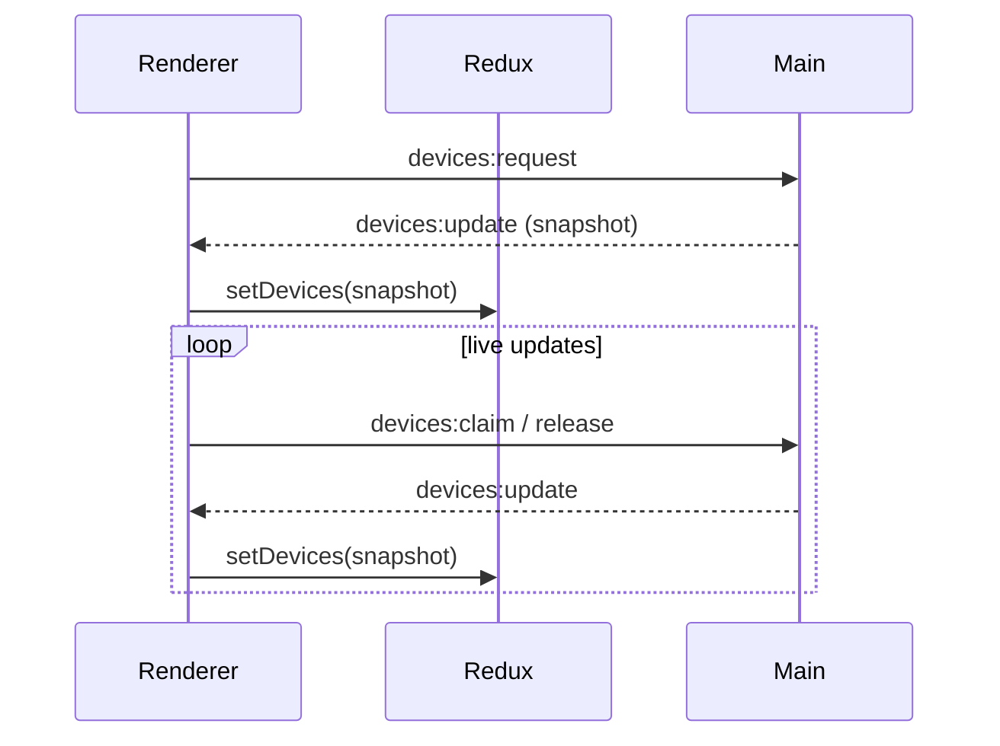

# Build & Device Workflow

This document centralizes all of the build outputs, scripts, and device-coordination details that were previously embedded in the root `README.md`.

## Build Workflow Overview
- **Webpack entry point** – `src/renderer/app/renderer.tsx` is the single entry. Webpack runs with `target: 'electron-renderer'`, so the bundled JS can access Electron APIs.
- **Babel + TypeScript** – `.tsx` files go through `babel-loader`, using presets from `.babelrc` (`@babel/preset-react` + `@babel/preset-typescript`). This removes the need for a separate renderer `tsc` step; `tsc` remains responsible for the main/preload build and general type checking.
- **tsconfig roles**
  - `tsconfig.json` – base config for `npm run build:main` and `npm run typecheck`.
  - `tsconfig.prod.json` – production variant used by `npm run build`.
  - `tsconfig.test.json` – lightweight config used by `ts-jest`, keeps Electron types out of the Jest environment.
- **CSS pipeline** – `css-loader` + `style-loader` allow `import './App.css'` inside TSX files. `style-loader` injects styles at runtime, so `index.html` loosens CSP with `style-src 'self' 'unsafe-inline'`.
- **Jest + CSS** – `tests/jest.config.js` maps CSS imports to `identity-obj-proxy`, so renderer components can be rendered in tests without touching real styles or DOM APIs.
- **Playwright** – `tests/playwright.config.ts` launches the compiled Electron app and stores HTML reports under `tests/test-results/playwright-report/`.

### Webpack Outputs
- Renderer bundling is handled by `webpack.config.js` with entry `src/renderer/app/renderer.tsx`.
- Running `npm run build:renderer` (or the full `npm run build`) writes the renderer artifacts to `dist/`:
  - `dist/bundle.js` – minified renderer bundle that `index.html` loads.
  - `dist/bundle.js.map` – source map (omitted in production).
  - `dist/bundle.js.LICENSE.txt` – third-party notices collected during bundling.

### TypeScript Compiler Outputs
The TypeScript compiler (`tsc`) powers the main process, type checking, and tests. Each `tsconfig` controls a different scenario:

| Config file         | Used by                             | Output / Purpose |
|---------------------|-------------------------------------|------------------|
| `tsconfig.json`     | `npm run build:main`, `npm run typecheck` | Compiles `src/main/**` (main process + preload) into `dist/main/**` (e.g., `dist/main/app/main.js`, `dist/main/index.js`). |
| `tsconfig.prod.json`| `npm run build` (production)        | Stricter version of the above for production builds (no incremental builds, tighter diagnostics). Outputs the same `dist/main/**` tree. |
| `tsconfig.test.json`| Jest via `ts-jest`                  | Guides `ts-jest` so tests run in a DOM-friendly environment without Electron globals; no emit. |

### Key Scripts

| Command              | Description                                                        |
|----------------------|--------------------------------------------------------------------|
| `npm run dev`        | Watch `src/**`, rebuild main + renderer, relaunch Electron with DevTools |
| `npm run dev:build`  | Rebuilds main + renderer once (no Electron launch)                  |
| `npm run build:main` | Compiles `src/main/**` via `tsc`                                    |
| `npm run build:renderer` | Bundles the React renderer via Webpack                          |
| `npm run typecheck`  | Runs the TypeScript compiler in `--noEmit` mode                     |
| `npm test`           | Jest suite (renderer/Redux unit tests)                              |
| `npm run test:ui`    | Playwright smoke test (requires prior `npm run build`)              |

## Project Structure
- `src/main/app/main.ts` – creates the `BrowserWindow`, registers IPC handlers, seeds mock USB devices.
- `src/renderer/app/App.tsx` – React entry point that consumes IPC-delivered device snapshots.
- `src/renderer/app/store/**` – Redux Toolkit store, slices, and typed hooks.
- `src/shared/models/**` – shared TypeScript types (`DeviceInfo`, etc.).
- `docs/redux-structure.md` – deep dive into Redux state shape and IPC data flow.

## Device Workflow
1. Main process holds an in-memory list of mock USB devices (`defaultDevices` in `main.ts`).
2. Renderer sends `devices:request`, `devices:claim`, `devices:release` via `ipcRenderer.send`.
3. Main responds with `devices:update` events containing the latest snapshot; Redux normalizes it (`setDevices`) and the UI re-renders.



## System Overview Diagram
```mermaid
flowchart TD
    subgraph Authoring
        UI[React/Redux TSX + CSS]
        MainTS[Electron main TS]
        Tests[Jest + Playwright]
    end

    subgraph Tooling
        Webpack[Webpack + Babel]
        TSC[tsc (tsconfig.json/prod/test)]
    end

    subgraph Outputs
        RendererBundle[dist/bundle.js + assets]
        MainBundle[dist/main/**]
        TestReports[tests/test-results/**]
    end

    subgraph Runtime
        ElectronApp[Electron app]
        DeviceStore[In-memory USB devices]
        ReduxState[Redux store]
    end

    UI --> Webpack --> RendererBundle --> ElectronApp
    MainTS --> TSC --> MainBundle --> ElectronApp
    Tests -->|ts-jest & Playwright| Tooling --> TestReports

    ElectronApp --> ReduxState
    ElectronApp --> DeviceStore
    ReduxState -->|feeds| DeviceTable[Device Table UI]
```

